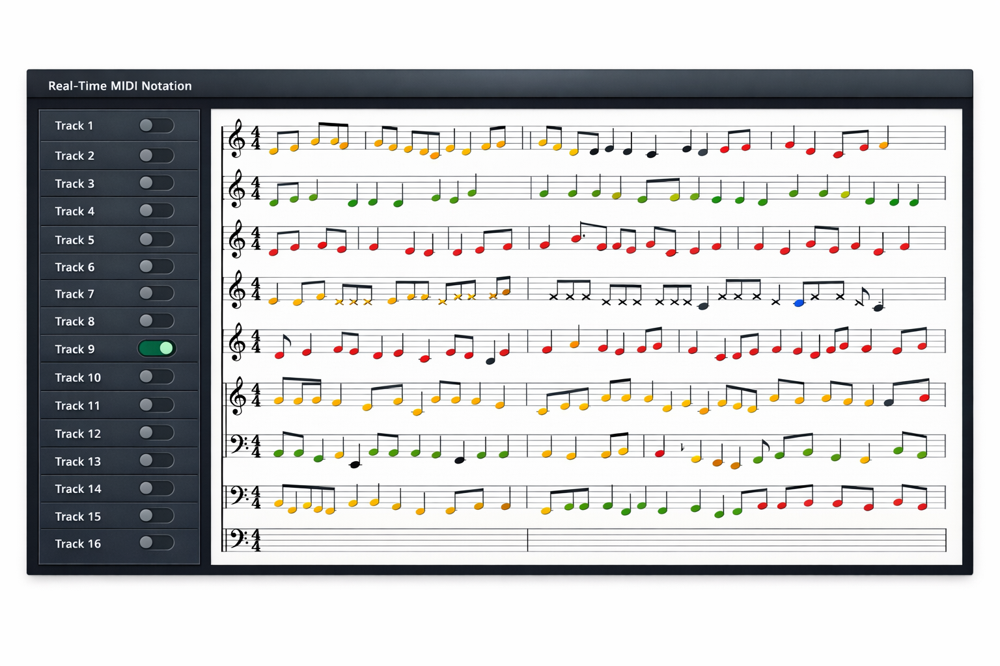

# 🎼 SIRIUS — Real‑Time MIDI Notation Engine  
### *Next‑generation real‑time multi‑track MIDI notation engine for musicians, educators & researchers.*

<p align="center">
  
</p>

<p align="center">
  <b>Python</b> • <b>Pygame</b> • <b>Real‑Time MIDI</b> • <b>Yamaha 16‑Track</b> • <b>Live Notation</b> • <b>Editing Layer v4.2.0</b>
</p>

---

# 📌 Table of Contents
- [Showcase](#-showcase)
- [Features](#-features)
- [Architecture](#-architecture)
- [Editing Layer (v4.2.0)](#-editing-layer-v420)
- [Installation](#-installation)
- [Supported Instruments](#-supported-instruments)
- [Who Is This For](#-who-is-this-for)
- [Roadmap](#-roadmap)
- [Academic Relevance](#-academic-relevance)
- [Long‑Term Vision](#-long-term-vision)
- [SEO Keywords](#-seo-keywords)
- [Summary](#-summary)

---

# 📸 Showcase  
<p align="center">
  
</p>

Do you use **SIRIUS / Real-Time MIDI Notation** in your setup?

👉 Open an Issue titled **“Showcase Submission”** and attach your screenshot.  
Community examples will be added here (with credit).

---

# 🚀 Features

| Category | Highlights |
|---------|------------|
| **Real‑Time Engine** | Zero‑latency rendering, instant beams/stems, velocity dynamics |
| **Multi‑Track** | Full Yamaha 16‑track arranger support |
| **Notation** | Real‑time engraving: beams, stems, barlines, grouping |
| **Visualization** | Color‑coded tracks, activity meters, timeline, grid |
| **Editing Layer v4.2.0** | Selection v2, Regions, Snapping v2, Ghost Notes/Regions |
| **Modular UI** | Replaceable components, custom renderers |
| **Performance Tools** | Micro‑timing, velocity maps, expressive analysis *(future)* |
| **Education Tools** | Real‑time feedback, rhythm training *(future)* |

---

# 🧠 Architecture

```
┌──────────────────────────────┐
│        MIDI Input Layer      │
└───────────────┬──────────────┘
                │
┌───────────────▼──────────────┐
│     Real‑Time Processing      │
│   (StreamHandler, Router)     │
└───────────────┬──────────────┘
                │
┌───────────────▼──────────────┐
│       Notation Processor      │
│ (notes, rhythm, timing, vel.) │
└───────────────┬──────────────┘
                │
┌───────────────▼──────────────┐
│        Editing Layer v4.2     │
│ (selection, regions, snapping)│
└───────────────┬──────────────┘
                │
┌───────────────▼──────────────┐
│       Modular UI Renderer     │
└──────────────────────────────┘
```

---

# ✏️ Editing Layer (v4.2.0)

Version **4.2.0** introduces the first fully integrated **Editing Layer**, including:

### ✔ Selection v2  
- multi‑selection  
- additive/subtractive selection  
- selection events  

### ✔ Region Editing  
- region creation  
- region splitting  
- region metadata  

### ✔ Snapping v2  
- time snapping  
- pitch snapping  
- configurable grid resolution  

### ✔ Ghost Previews  
- ghost notes  
- ghost regions  
- hover previews  
- non‑destructive editing  

This layer prepares the system for **Editing API v4.3.0** and full real‑time editing in Runtime Engine 6.0.0.

---

# 📦 Installation

```bash
git clone https://github.com/richardpizem-ctrl/Real-Time-MIDI-Notation
cd Real-Time-MIDI-Notation
python main.py
```

Full installation guide: **INSTALLATION.md**

---

# 🎹 Supported Instruments

- Yamaha PSR / Tyros / Genos  
- Korg PA series  
- Roland Fantom / Juno  
- Kurzweil PC series  

> ❗ Casio is **not** a target platform.

---

# 🎯 Who Is This For?

- real‑time MIDI visualizers  
- DAW companion tools  
- music education  
- live performance analysis  
- Yamaha arranger users  
- MIDI debugging  
- research & academia  
- studios needing **pre‑recording diagnostics**  

---

# 🧪 Testing Policy

Real‑time MIDI systems behave differently depending on:

- OS  
- drivers  
- latency  
- hardware  
- Python version  

Please test on your system and report issues.

---

# 🤝 Contributing

- Keep PRs modular  
- Follow v4.2.0 architecture  
- No heavy dependencies  
- Real‑time code must stay fast  
- Editing Layer changes must follow event‑driven design  

See **CONTRIBUTING.md** for full rules.

---

# 🧭 Roadmap

### 🔥 v4.3.0 — Editing API v1
- high‑level editing operations  
- undo/redo v2  
- batch editing  
- quantization hooks  

### 🚀 v5.x — Engraving Engine
- slurs, ties, articulations  
- spacing engine  
- collision avoidance  
- MusicXML export  

### 🌌 Long‑Term
- predictive layout (AI‑assisted)  
- performance analytics  
- standalone hardware device  

---

# 🎓 Academic Relevance

Suitable for:

- music informatics  
- real‑time systems  
- HCI  
- performance analysis  
- pedagogy  

CITATION.cff included.

---

# 🌟 Long‑Term Vision

## 🎼 1. Sheet Music for Musicians Who Play by Ear  
Generate professional sheet music from live performance.

## 🎹 2. Bridge Amateur ↔ Professional Worlds  
Convert ideas → notation → orchestration.

## 🧪 3. Research Platform  
Timing deviation, expressive performance, visualization.

## 📄 4. Export & Sharing  
Snapshots, score exports, timeline exports.

## 🎼 5. Future Engraving Engine  
Spacing, collision avoidance, slurs, ties, articulations.

---

# 🔎 SEO Keywords  
`midi`, `real-time midi`, `midi notation`, `pygame`, `python midi`,  
`multi-track midi`, `live midi`, `midi processing`,  
`midi sheet music`, `midi score`,  
`notation engine`, `real-time notation`, `music education`,  
`editing layer`, `midi editor`, `real-time editing`

---

# 🧩 Summary

SIRIUS is:

- the **first open‑source real‑time multi‑track MIDI notation engine**  
- built for musicians, educators, researchers  
- modular, stable, expandable  
- now equipped with **Editing Layer v4.2.0**  
- visually branded under **SIRIUS**  
- foundation of the **future engraving engine (v5)**  
